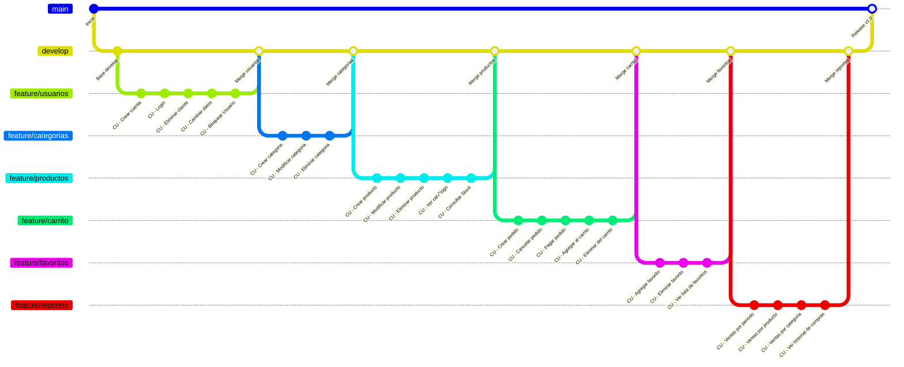

# Taller De Integración "Catálogo de Productos"
Repositorio para el proyecto de Taller de Integración de la Universidad Nacional de la Matanza. Grupo 121

El objetivo es desarrollar un sistema de **cat√°logo de productos con carrito de compras**, que contemple tanto la perspectiva del **usuario final** como la del **administrador**.

### Funcionalidades principales
- **Usuarios finales** podr√°n:
  - Navegar el cat√°logo de productos.
  - Filtrar por categoría, marca y precio.
  - Marcar productos como favoritos.
  - Agregar productos al carrito y realizar compras.
  - Visualizar historial de compras.

- **Administradores** podr√°n:
  - Crear, modificar y dar de baja productos.
  - Gestionar categorías y subcategorías.
  - Administrar promociones y descuentos.
  - Controlar pedidos y estados de compra.

### Consultas requeridas
1. Historial de compras por usuario.  
2. Lista de favoritos de un usuario.  
3. Productos m√°s vendidos en un rango de fechas.  
4. Productos con stock bajo o limitado.  
5. Categorías con más ventas acumuladas.  
6. Monto total de ventas por período.  

---

## Stack Tecnológico: **MEAN**
El proyecto se desarrollar√° utilizando el stack **MEAN**, compuesto por:

- **MongoDB** → Base de datos NoSQL para almacenar información de usuarios, productos, pedidos y promociones de manera flexible.  
- **Express.js** → Framework para Node.js que permitirá crear la API REST, centralizando la lógica de negocio.  
- **Angular** → Framework frontend para construir una interfaz dinámica y modular, con navegación SPA (Single Page Application).  
- **Node.js** → Entorno de ejecución del lado del servidor, que brindará escalabilidad y rapidez en las operaciones.  

### 🚀 ¿Por qué MEAN?
- Permite trabajar con **JavaScript en todas las capas** (frontend, backend y base de datos).  
- **MongoDB** se adapta bien al dominio del problema (productos con atributos variables, promociones din√°micas, historial de compras).  
- **Angular** ofrece una estructura robusta para el frontend, ideal para proyectos académicos con varios integrantes.  
- La integración **Node.js + Express + MongoDB** es natural, y facilita el desarrollo de una API REST escalable.  

---

## ⚙ Organización de trabajo: **GitFlow**
El trabajo será organizado bajo la metodología gitflow, creando una rama por cada feature significante, basandose en los casos de Uso.
La división de ramas es la siguiente:
- **feature/usuarios**: login, alta, baja y modificación de usuarios
- **feature/carrito**: Gestión de pedidos y carrito
- **feature/categorias**: alta, baja y modificación de categorías
- **feature/favoritos**: agregar, eliminar y ver favoritos
- **feature/productos**: alta, baja y modificación de productos, además de visualizar el catálogo y reporte de stock
- **feature/promociones**: alta, baja y modificación de promociones, y ver el catálogo de promociones
- **feature/reportes**: ver historial de compras (cliente), reportes de ventas por categoría, procucto y período

```mermaid
gitGraph
   commit id: "Inicio"
   branch develop
   commit id: "Base develop"

   branch feature/usuarios
   commit id: "CU - Crear cuenta"
   commit id: "CU - Login"
   commit id: "CU - Eliminar cliente"
   commit id: "CU - Cambiar datos"
   commit id: "CU - Bloquear Usuario"
   checkout develop
   merge feature/usuarios id: "Merge usuarios"

   branch feature/categorias
   commit id: "CU - Crear categoria"
   commit id: "CU - Modificar categoria"
   commit id: "CU - Eliminar categoria"
   checkout develop
   merge feature/categorias id: "Merge categorias"

   branch feature/productos
   commit id: "CU - Crear producto"
   commit id: "CU - Modificar producto"
   commit id: "CU - Eliminar producto"
   commit id: "CU - Ver cat√°logo"
   commit id: "CU - Consultar Stock"
   checkout develop
   merge feature/productos id: "Merge productos"

   branch feature/carrito
   commit id: "CU - Crear pedido"
   commit id: "CU - Cancelar pedido"
   commit id: "CU - Pagar pedido"
   commit id: "CU - Agregar al carrito"
   commit id: "CU - Eliminar del carrito"
   checkout develop
   merge feature/carrito id: "Merge carrito"

   branch feature/favoritos
   commit id: "CU - Agregar favorito"
   commit id: "CU - Eliminar favorito"
   commit id: "CU - Ver lista de favoritos"
   checkout develop
   merge feature/favoritos id: "Merge favoritos"

   branch feature/reportes
   commit id: "CU - Ventas por periodo"
   commit id: "CU - Ventas por producto"
   commit id: "CU - Ventas por categoria"
   commit id: "CU - Ver historial de compras"
   checkout develop
   merge feature/reportes id: "Merge reportes"

   checkout main
   merge develop id: "Release v1.0"
```
